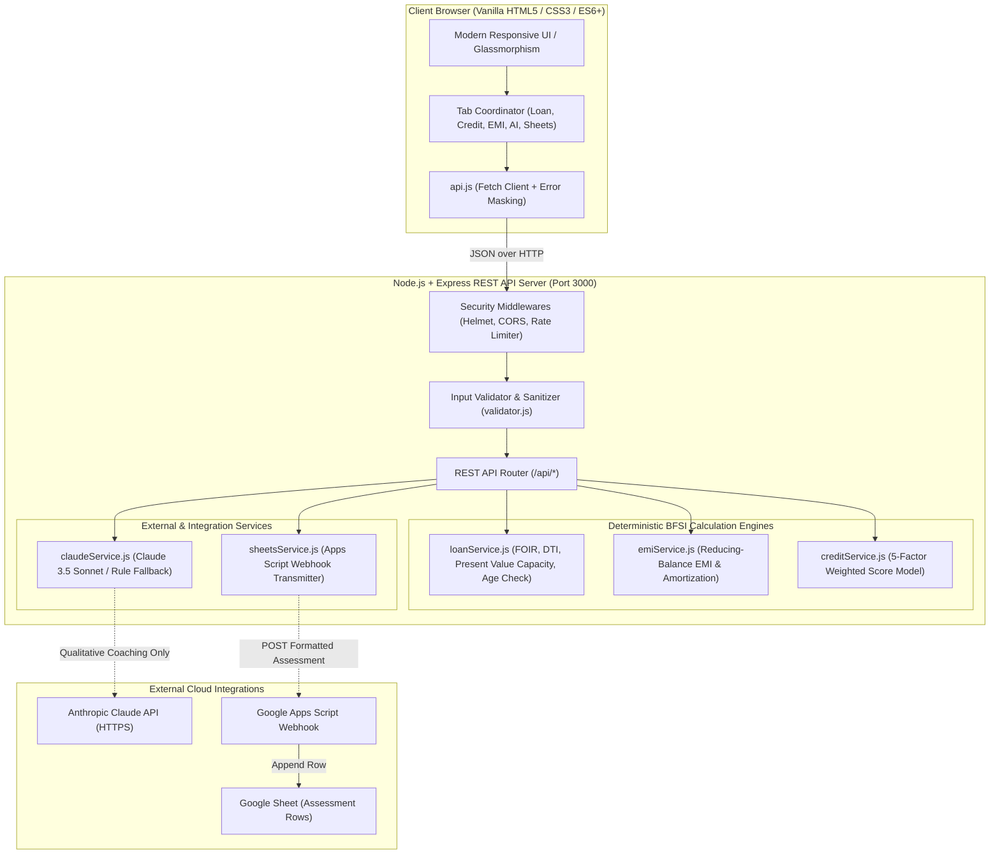
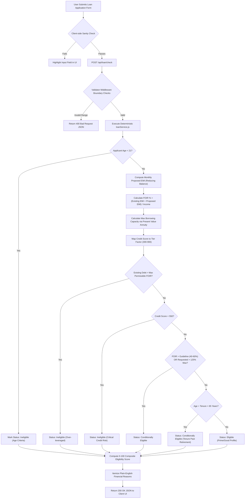
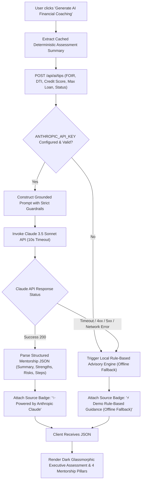
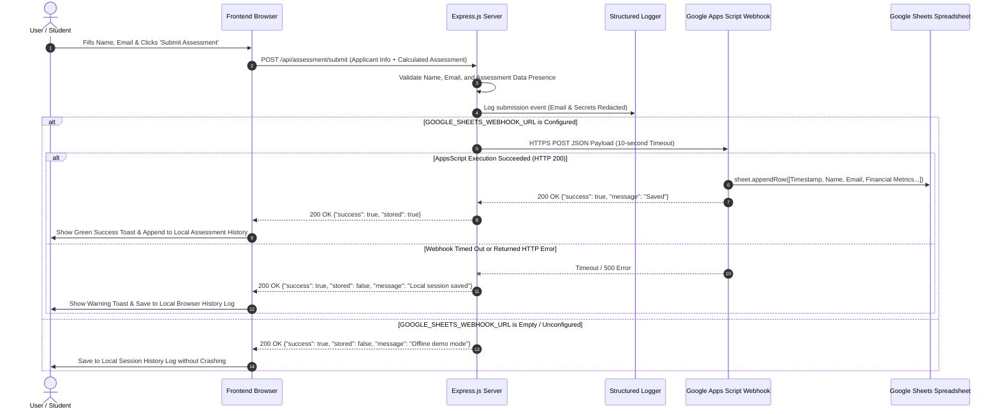

# AI Loan Eligibility Checker 🏦

[](https://nodejs.org/)
[](LICENSE)
[](https://www.anthropic.com/)
[](#educational-bfsi-disclaimer)
[](#automated-testing-guide)

A modern, responsive, full-stack educational financial technology (Fintech) web application designed for banking, financial services, and insurance (BFSI) decision-making simulation.

The platform demonstrates how modern digital lending institutions evaluate retail credit applicants using **100% deterministic mathematical rules**, analyzes credit bureau score health across **5 weighted factors**, simulates reducing-balance Equated Monthly Installments (**EMI**) with full month-by-month amortization schedules, delivers qualitative financial literacy coaching via **Anthropic Claude 3.5 Sonnet** (with an automatic, transparent offline fallback), and logs student assessments to **Google Sheets** via an authenticated Google Apps Script Webhook.

---

## ⚠️ Educational BFSI Disclaimer

> [!IMPORTANT]
> **ACADEMIC DEMONSTRATION ONLY**: This application is an educational capstone project developed strictly for academic demonstration and financial literacy training.
> - It simulates retail credit decisioning through heuristic benchmark algorithms (FOIR, DTI, credit tier weighting, and present value annuity limits).
> - It **does NOT** represent a registered bank, Non-Banking Financial Company (NBFC), or licensed credit counseling organization.
> - It **does NOT** issue real bank sanction letters, disbursement approvals, or legal loan commitments.
> - It **does NOT** constitute certified financial, legal, or investment advice.

---

## 🏛️ Core Architectural Principles

The application is architected around the following strict software engineering principles:

1. **Deterministic Calculation Separation**:
   All core financial calculations (eligibility, maximum borrowing limits, FOIR, DTI, monthly EMI, and credit scoring) are calculated **100% deterministically on the Node.js backend**. The AI model (Claude) is **strictly forbidden** from generating or modifying any financial numbers or approval verdicts.
2. **AI as Qualitative Mentor**:
   Anthropic Claude is utilized solely as an educational financial mentor to explain *why* an applicant's debt profile looks the way it does and to provide actionable credit repair and budgeting advice.
3. **Fail-Safe Offline Resilience**:
   If Claude API or Google Sheets are unconfigured, rate-limited, or unreachable, the application gracefully falls back to deterministic rule engines and local session storage without throwing uncaught exceptions or crashing.
4. **Zero Client-Side Secret Leakage**:
   API keys, webhook URLs, and sensitive credentials reside strictly on the server and are scrubbed by automated logger redaction.

---

## 📊 Comprehensive Visual Workflows (Mermaid Diagrams)

### 1. Overall System Architecture


---

### 2. Loan Eligibility Decisioning Workflow


---

### 3. EMI Calculation & Amortization Workflow
```mermaid
flowchart TD
    UserInputs["User Inputs: Principal P, Annual Rate R, Tenure N"] --> SyncInputs["Synchronize Sliders and Number Inputs"]
    SyncInputs --> PostCalc["POST /api/emi/calculate"]
    PostCalc --> CheckRate{"Interest Rate R == 0%?"}
    
    CheckRate -->|Yes (Zero Interest)| ZeroFormula["EMI = Principal / Tenure N"]
    ZeroFormula --> GenZeroTable["Generate Zero-Interest Amortization Table"]
    
    CheckRate -->|No (R > 0%)| MonthlyRate["Convert Annual Rate R to Monthly Rate r = (R / 12) / 100"]
    MonthlyRate --> StandardFormula["Apply Formula: EMI = P * r * (1+r)^N / ((1+r)^N - 1)"]
    StandardFormula --> SummaryMath["Compute Total Payable = EMI * N, Total Interest = Total Payable - P"]
    
    SummaryMath --> AmortLoop["Loop Period t = 1 to N"]
    AmortLoop --> PeriodMath["Interest_t = Opening_t * r, Principal_t = EMI - Interest_t"]
    PeriodMath --> BalanceMath["Closing_t = max(0, Opening_t - Principal_t)"]
    BalanceMath --> NextPeriod{"t < N?"}
    NextPeriod -->|Yes| NextOpening["Opening_(t+1) = Closing_t"] --> AmortLoop
    NextPeriod -->|No| ReturnJSON["Return EMI Summary & Complete Schedule Array"]
    GenZeroTable --> ReturnJSON
    ReturnJSON --> RenderUI["Render Metric Cards, Proportion Bar, and Amortization Table"]
```

---

### 4. AI Financial Mentor & Fallback Workflow


---

### 5. Google Sheets Webhook Data Flow


---

## ✨ Modular Feature Specifications

### Module 1: Deterministic Loan Eligibility Checker
- **Inputs**: Net Monthly Income (₹), Existing Monthly Debt EMI (₹), Requested Principal (₹), Tenure (Months), Annual Interest Rate (%), Credit Score (300–900), Applicant Age (18–100), Employment Type.
- **FOIR Gating**: Dynamically adjusts maximum permissible debt obligation according to income tiers ($40\%$ for $\le ₹30,000$, $50\%$ for $₹30,001–₹75,000$, $60\%$ for $> ₹75,000$).
- **Present Value Annuity Limit**: Mathematically calculates maximum eligible loan capacity so applicant cannot exceed debt capacity.
- **Applicant Age Evaluation**: Enforces primary borrower minimum age benchmark of 21 years and detects loan maturities past retirement (age 65).
- **Composite Score (0–100)**: Evaluates FOIR headroom (35 pts), Credit Score rating (40 pts), Requested vs Max capacity (15 pts), and Employment stability (10 pts).

### Module 2: Credit Score Health Analyzer
- **Scale**: Standard bureau range ($300$ to $900$).
- **Interactive Gauge**: Visual needle gauge displaying real-time risk tiers (*Excellent: 750–900*, *Good: 700–749*, *Fair: 650–699*, *Poor: 550–649*, *Critical: 300–549*).
- **5-Factor Weighting Breakdown**:
  - Payment History: $35\%$
  - Credit Utilization: $30\%$
  - Length of Credit History: $15\%$
  - Credit Mix: $10\%$
  - Recent Inquiries: $10\%$
- **Diagnostic Guidance**: Specific action plans to boost credit rating.

### Module 3: Interactive EMI & Amortization Calculator
- **Mathematical Formula**: Standard reducing-balance compound interest formula.
- **Zero-Interest Compatibility**: Seamlessly handles promotional $0\%$ APR financing without division-by-zero errors.
- **Synchronized Controls**: Range sliders and numeric text fields sync instantaneously with zero lag.
- **Visual Ratio**: Interactive proportion bar highlighting Principal vs Interest breakdown.
- **Amortization Schedule**: Complete period-by-period table detailing Opening Principal, EMI, Principal Repaid, Interest Repaid, and Closing Principal formatted in Indian Rupee standard (`₹ xx,xx,xxx`).

### Module 4: Anthropic Claude AI Financial Mentor
- **Contextual Grounding**: Receives calculated FOIR, DTI, credit score, and status from the backend.
- **Strict Guardrails**: Prompt constraints prevent number hallucination or calculation override.
- **4 Mentorship Pillars**:
  1. *Eligibility Explanation*: Why the applicant is Eligible, Conditionally Eligible, or Ineligible in plain terms.
  2. *Cash Flow & EMI Impact*: How the monthly obligation affects disposable income and emergency savings.
  3. *Credit Repair Strategy*: Concrete steps to improve utilization and score tiers.
  4. *Responsible Borrowing*: Advice on tenure trade-offs and prepayments.
- **Offline Fallback Engine**: Activates when API key is missing or network fails, badging the output transparently in the UI.

### Module 5: Google Sheets Data Logging
- **Persistent Storage**: Submits student assessment records directly to Google Sheets.
- **Apps Script Webhook**: Eliminates complex GCP Service Account credentials in educational environments.
- **Offline Session History**: Maintains evaluation records in browser session cache even if webhook is unconfigured.

---

## 📐 Deterministic Mathematical Specifications

### 1. Reducing-Balance Equated Monthly Installment (EMI)
For principal $P$, annual interest rate $R\%$, and tenure $N$ months:
$$\text{Monthly Interest Rate } r = \frac{R}{12 \times 100}$$

If $r > 0$:
$$\text{EMI} = P \times r \times \frac{(1 + r)^N}{(1 + r)^N - 1}$$

If $r = 0$:
$$\text{EMI} = \frac{P}{N}$$

Total Repayment Amount:
$$\text{Total Payable} = \text{EMI} \times N$$
$$\text{Total Interest} = \text{Total Payable} - P$$

### 2. Fixed Obligation to Income Ratio (FOIR)
$$\text{FOIR} = \left( \frac{\text{Existing Monthly EMI} + \text{Proposed Loan EMI}}{\text{Net Monthly Income}} \right) \times 100$$

### 3. Debt-to-Income (DTI) Ratio
$$\text{DTI} = \left( \frac{\text{Existing Monthly Debt EMI}}{\text{Net Monthly Income}} \right) \times 100$$

### 4. Maximum Approved Borrowing Capacity (Present Value)
Let $\text{MaxAllowableEMI} = (\text{Monthly Income} \times \text{MaxFOIRRate}) - \text{Existing EMI}$.
$$\text{Max Capacity} = \text{MaxAllowableEMI} \times \left[ \frac{1 - (1 + r)^{-N}}{r} \right] \times \text{CreditFactor}$$

---

## 🛠️ Tech Stack & Software Architecture

| Layer | Technologies |
|---|---|
| **Frontend** | HTML5, CSS3 (Custom Properties, Glassmorphism, CSS Grid), Vanilla ES6+ JavaScript |
| **Backend** | Node.js (v18+), Express.js framework |
| **Security** | Helmet (CSP headers), Express Rate Limit (150 req / 15 min), CORS, Custom Input Sanitizer |
| **AI Integration** | Anthropic Claude API (`@anthropic-ai/sdk`), Claude 3.5 Sonnet model |
| **Data Persistence**| Google Sheets via Google Apps Script Webhook (POST JSON) |
| **Testing** | Node.js native test runner (`node --test`), Assert module |

---

## 📁 Repository File Structure

```
AI Loan Eligibility checker/
├── public/                          # Frontend static assets
│   ├── css/
│   │   ├── variables.css            # Design tokens, color palette, shadows, typography
│   │   └── style.css                # Layout, components, cards, dark glassmorphism, responsive
│   ├── js/
│   │   ├── config.js                # Frontend API endpoint configurations
│   │   ├── api.js                   # Client fetch wrapper with error handling & timeouts
│   │   ├── loanChecker.js           # Module 1: Eligibility assessment UI logic
│   │   ├── creditAnalyzer.js        # Module 2: Credit score gauge & factor breakdown
│   │   ├── emiCalculator.js         # Module 3: Sliders, math, & amortization table generator
│   │   ├── aiTips.js                # Module 4: AI Financial Mentor UI & glassmorphic summary
│   │   ├── sheetsSubmission.js      # Module 5: Google Sheets submission & session history
│   │   └── app.js                   # Global coordinator (tabs, toasts, mobile menu)
│   ├── index.html                   # Single-Page Application HTML document
│   └── favicon.ico                  # Application icon
├── server/                          # Backend Express.js application
│   ├── config/
│   │   ├── constants.js             # Financial threshold constants (FOIR, DTI, credit tiers)
│   │   └── cors.js                  # CORS origins configuration
│   ├── controllers/                 # Express route handlers
│   │   ├── loanController.js        # Eligibility verification endpoint handler
│   │   ├── emiController.js         # EMI & schedule calculation endpoint handler
│   │   ├── creditController.js      # Credit factor evaluation endpoint handler
│   │   ├── aiController.js          # Claude API & fallback dispatch handler
│   │   └── sheetsController.js      # Google Sheets webhook dispatcher
│   ├── middleware/
│   │   ├── validator.js             # Strict input validation and sanitization
│   │   ├── errorHandler.js          # Centralized error handler with secret redaction
│   │   └── logger.js                # Structured request logger with PII masking
│   ├── routes/
│   │   └── apiRoutes.js             # Unified REST route declarations
│   ├── services/                    # Business logic and mathematical engines
│   │   ├── loanService.js           # Deterministic loan evaluation & present value capacity
│   │   ├── emiService.js            # Standard reducing-balance EMI & amortization engine
│   │   ├── creditService.js         # 5-factor weighted credit evaluation algorithm
│   │   ├── claudeService.js         # Anthropic Claude SDK client with 4-pillar prompt
│   │   └── sheetsService.js         # Google Apps Script HTTP webhook client
│   ├── utils/
│   │   └── AppError.js              # Operational error abstraction
│   └── index.js                     # Express server bootstrap & static file server
├── tests/                           # Complete automated test suite (52 tests)
│   ├── loanService.test.js          # Eligibility, FOIR, DTI, and age gating tests
│   ├── emiService.test.js           # EMI mathematical precision & schedule tests
│   ├── creditService.test.js        # 5-factor credit tier weighting tests
│   ├── claudeService.test.js        # Prompt guardrails, timeouts, & fallback tests
│   ├── sheetsService.test.js        # Webhook payload, history cache, & offline resilience tests
│   ├── validation.test.js           # Input validation boundaries & age parameter tests
│   ├── infrastructure.test.js       # Health endpoint, error masking, & logger tests
│   ├── sanity.test.js               # Constants integrity tests
│   └── client_syntax_check.js       # Frontend ES6 script syntax validation
├── .env.example                     # Environment template with dummy placeholders
├── .gitignore                       # Git exclusion list (node_modules, .env, secrets)
├── package.json                     # Node.js project manifest & scripts
├── Procfile                         # Cloud deployment definition for PaaS (Heroku / Railway)
├── vercel.json                      # Vercel deployment configuration
├── netlify.toml                     # Netlify deployment configuration
└── README.md                        # Project documentation & reference manual
```

---

## 🚀 Quickstart & Local Setup

### System Prerequisites
- **Node.js**: v18.0.0 or higher ([nodejs.org](https://nodejs.org/))
- **npm**: v9.0.0 or higher (shipped with Node.js)

### 1. Clone the Repository
```bash
git clone https://github.com/your-username/ai-loan-eligibility-checker.git
cd "AI Loan Eligibility checker"
```

### 2. Install Project Dependencies
```bash
npm install
```

### 3. Configure Local Environment Variables
Create your local `.env` from the provided template:
```bash
# On Linux / macOS:
cp .env.example .env

# On Windows PowerShell:
Copy-Item .env.example .env
```

Review and adjust `.env` (the application works seamlessly even with blank keys):
```env
PORT=3000
NODE_ENV=development
ALLOWED_ORIGINS=http://localhost:3000

# Optional: Add your key for live Claude 3.5 Sonnet mentoring
ANTHROPIC_API_KEY=

# Optional: Add your Apps Script Webhook URL for Google Sheets logging
GOOGLE_SHEETS_WEBHOOK_URL=
```

### 4. Start the Application Server
```bash
npm start
```
The application will start on:
```
http://localhost:3000
```
Open this URL in your web browser to explore all five interactive financial modules.

---

## 🔑 Anthropic Claude AI Setup & Guardrails

The application integrates Anthropic Claude 3.5 Sonnet to provide personalized financial mentoring.

### 1. Obtaining an API Key
1. Register at the [Anthropic Console](https://console.anthropic.com/).
2. Navigate to **API Keys** and generate a new key (`sk-ant-...`).
3. Add the key to your `.env`:
   ```env
   ANTHROPIC_API_KEY=sk-ant-api03-...
   ```
4. Restart your application (`npm start`).

### 2. Strict Prompt Guardrails
To prevent hallucination or unauthorized financial commitments, the backend enforces:
- **Zero Calculation Authority**: Claude is explicitly instructed that it has no ability to calculate eligibility scores, FOIR, DTI, or loan amounts.
- **Fact-Based Prompt Injection**: The backend calculates all metrics first and passes them as read-only facts.
- **4-Pillar Coaching**: Claude must structure advice around:
  1. Root cause of approval/ineligibility
  2. Cash flow & monthly EMI impact
  3. Actionable credit repair roadmap
  4. Prudent borrowing practices

### 3. Graceful Offline Fallback
If the Claude API key is empty, times out (>10s), encounters rate limits (HTTP 429), or fails, the server activates a deterministic rule-based guidance engine. The UI clearly displays:
- Live Claude: `<span class="ai-badge source-claude">✨ Powered by Anthropic Claude (claude-3-5-sonnet)</span>`
- Fallback: `<span class="ai-badge source-fallback">⚡ Demo Rule-Based Guidance (Offline Fallback)</span>`

---

## 📊 Google Sheets Webhook Integration Setup

Log evaluation assessments to Google Sheets without downloading service account JSON keys or managing IAM credentials.

### 1. Create a Google Sheet
Create a sheet titled **"AI Loan Assessments"** and populate Row 1 with these exact headers:
```
Timestamp | Applicant Name | Email | Monthly Income (₹) | Loan Requested (₹) | Tenure (Mos) | Interest Rate (%) | Credit Score | Calculated EMI (₹) | Max Approved (₹) | Status | Risk Tier | Eligibility Score (/100)
```

### 2. Add Google Apps Script
1. In your sheet, click **Extensions** → **Apps Script**.
2. Replace all script code with:
```javascript
function doPost(e) {
  try {
    var sheet = SpreadsheetApp.getActiveSpreadsheet().getActiveSheet();
    var data = JSON.parse(e.postData.contents);
    
    sheet.appendRow([
      data.timestamp || new Date().toISOString(),
      data.applicantName || 'Anonymous Demo Applicant',
      data.applicantEmail || 'N/A',
      data.monthlyIncome || 0,
      data.requestedLoanAmount || 0,
      data.tenureMonths || 0,
      data.interestRate || 0,
      data.creditScore || 0,
      data.calculatedEmi || 0,
      data.maxEligibleAmount || 0,
      data.status || 'N/A',
      data.riskTier || 'N/A',
      data.eligibilityScore || 0
    ]);
    
    return ContentService.createTextOutput(JSON.stringify({
      success: true,
      message: "Assessment record saved successfully"
    })).setMimeType(ContentService.MimeType.JSON);
  } catch (err) {
    return ContentService.createTextOutput(JSON.stringify({
      success: false,
      error: err.toString()
    })).setMimeType(ContentService.MimeType.JSON);
  }
}
```

### 3. Deploy Web App
1. Click **Deploy** → **New deployment**.
2. Select type: **Web app**.
3. Set **Execute as**: `Me`.
4. Set **Who has access**: `Anyone`.
5. Deploy and copy the **Web app URL** (`https://script.google.com/macros/s/.../exec`).
6. Set in `.env`:
   ```env
   GOOGLE_SHEETS_WEBHOOK_URL=https://script.google.com/macros/s/your_deployment_id/exec
   ```

---

## 📡 REST API Reference

All requests and responses use `application/json`.

### 1. System Health Check
`GET /api/health`
```json
{
  "success": true,
  "data": {
    "status": "healthy",
    "app": "AI Loan Eligibility Checker",
    "version": "1.0.0",
    "uptimeSeconds": 142,
    "integrations": {
      "aiProvider": "claude-3-5-sonnet",
      "googleSheets": "connected"
    },
    "disclaimer": "Educational & Demo Project - Not for official banking or financial decisions."
  }
}
```

### 2. Check Loan Eligibility
`POST /api/loan/check`
- **Body**:
  ```json
  {
    "monthlyIncome": 75000,
    "existingEmi": 10000,
    "requestedLoanAmount": 800000,
    "tenureMonths": 60,
    "interestRate": 8.5,
    "creditScore": 760,
    "employmentType": "Salaried",
    "age": 28
  }
  ```
- **Response**:
  ```json
  {
    "success": true,
    "data": {
      "isEligible": true,
      "status": "Eligible",
      "eligibilityScore": 88,
      "riskTier": "Low Default Risk (Prime Tier)",
      "applicantAge": 28,
      "maxEligibleAmount": 1324768,
      "calculatedEmi": 16422,
      "foir": 35.2,
      "dti": 13.3,
      "reasons": [
        "FOIR of 35.2% is within the demo guideline limit of 50%.",
        "Credit score of 760 qualifies for standard approval in this demo model.",
        "Requested amount of ₹8,00,000 is within maximum estimated capacity of ₹13,24,768."
      ]
    }
  }
  ```

### 3. Calculate EMI & Amortization
`POST /api/emi/calculate`
- **Body**: `{"principal": 500000, "annualInterestRate": 9.5, "tenureMonths": 36}`
- **Response**: Returns `monthlyEmi`, `totalInterest`, `totalPayable`, and full `amortizationSchedule` array.

### 4. Analyze Credit Score
`POST /api/credit/analyze`
- **Body**: `{"creditScore": 740}`
- **Response**: Returns score tier, rating label, percentile rank, and 5-factor weighted breakdown.

### 5. Generate AI Financial Coaching
`POST /api/ai/tips`
- **Body**: Contains financial summary (`monthlyIncome`, `creditScore`, `foir`, `dti`, `status`).
- **Response**: Returns qualitative `summary`, `strengths`, `risks`, `recommendations`, and `source` (`"claude"` or `"fallback"`).

### 6. Submit Assessment to Google Sheets
`POST /api/assessment/submit`
- **Body**: `{"applicantName": "Rahul Verma", "applicantEmail": "rahul@example.com", "assessmentData": {...}}`
- **Response**: `{"success": true, "data": {"stored": true, "message": "Saved to Google Sheet"}}`

### 7. Retrieve Assessment History
`GET /api/assessment/history`
- **Response**:
  ```json
  {
    "success": true,
    "data": [
      {
        "id": "rec_1790187834422_cjr36",
        "timestamp": "2026-09-23T18:23:54.422Z",
        "applicantName": "Deepa Nair",
        "applicantEmail": "deepa@example.com",
        "monthlyIncome": 80000,
        "requestedLoanAmount": 1200000,
        "creditScore": 780,
        "status": "Eligible",
        "riskTier": "Low Risk"
      }
    ],
    "count": 1
  }
  ```

---

## 🧪 Automated Testing Guide

Run the full automated test suite using the built-in Node.js test runner:
```bash
npm test
```

### Complete Test Matrix (52 Passing Tests)
- **`tests/loanService.test.js`** (9 tests): Prime eligibility, over-leveraged ineligibility, critical credit score gating, conditional eligibility with reduced principal, zero debt obligations, score range boundaries, underage applicant gating (< 21), retirement maturity check (> 65), and custom adult applicant age.
- **`tests/emiService.test.js`** (6 tests): Standard benchmark verification (₹1,00,000 at 10% for 12 mos), zero-interest handling, boundary tenures (1 mo to 360 mos), input validation, and amortization schedule numerical balance.
- **`tests/creditService.test.js`** (4 tests): Credit tier classification, boundary values (300 and 900), out-of-bounds rejection, and 5-factor weighting structure.
- **`tests/claudeService.test.js`** (8 tests): System prompt integrity, missing key fallback, valid mocked completion, API timeout fallback, HTTP 429 rate limit fallback, API key secrecy, and immutability of calculations.
- **`tests/sheetsService.test.js`** (7 tests): Payload row formatting, unconfigured webhook resilience, mock submission success, non-200 webhook error handling, timeout handling, webhook URL leakage protection, and dynamic assessment history storage & retrieval.
- **`tests/validation.test.js`** (5 tests): Valid loan check payloads, missing/invalid parameter rejections, EMI boundaries, credit score boundaries, and applicant age boundaries.
- **`tests/infrastructure.test.js`** (10 tests): Safe logger key redaction, AppError operational class, JSON syntax error handler, 404 handler, error key masking, CORS handler, fallback engine, sheets unconfigured handling, `GET /api/health` integration test, and `GET /api/assessment/history` integration test.
- **`tests/sanity.test.js`** (3 tests): Financial constants validation, middleware structure, and formula precision.

To validate frontend JavaScript syntax:
```bash
node tests/client_syntax_check.js
```

---

## ☁️ Production Deployment Guide

### Option 1: Monolithic Deployment (Render / Railway)
1. Push repository to GitHub.
2. Create a new **Web Service** on [Render](https://render.com) or [Railway](https://railway.app).
3. Set **Build Command**: `npm install`
4. Set **Start Command**: `npm start`
5. Configure Environment Variables in the service settings (`PORT`, `NODE_ENV=production`, `ANTHROPIC_API_KEY`, `GOOGLE_SHEETS_WEBHOOK_URL`).

### Option 2: Split Architecture (Frontend on Vercel / Netlify, Backend on Render)
1. Deploy the backend Express service on Render/Railway.
2. In `public/js/config.js`, point `API_BASE_URL` to your live backend domain:
   ```javascript
   API_BASE_URL: 'https://your-loan-api.onrender.com/api'
   ```
3. Deploy the `public/` directory to Netlify or Vercel.
4. Set `ALLOWED_ORIGINS` in your backend `.env` to your frontend domain to allow cross-origin requests.

### Option 3: Serverless / Cloud Hosting (Vercel & Netlify)
- **Vercel**: Deploy directly using the included `vercel.json`. Vercel automatically routes `/api/*` requests to the Express serverless backend and serves static files from `public/`.
- **Netlify**: Deploy using the included `netlify.toml` which configures publish directory (`public`) and single-page application redirect rules.

---

## 🎨 UI Design System & Dark Glassmorphism

The application features a modern SaaS/Fintech user interface:
- **Design Tokens**: Centralized in `public/css/variables.css` using CSS custom properties (`--color-primary`, `--color-success`, `--radius-lg`, etc.).
- **Dark Glassmorphism Elements**:
  - **Live SaaS Simulation Card**: Dark translucent background (`rgba(15, 23, 42, 0.94)`), `backdrop-filter: blur(16px)`, specular glass borders (`rgba(255, 255, 255, 0.12)`), and glowing indicator badges.
  - **Executive AI Coaching Card**: Deep slate/purple frosted container with radial ambient glow, high-contrast headings, and clean typographic hierarchy.
- **Accessibility & Contrast**: Built to meet WCAG AA contrast guidelines across light cards and dark glass modules.

---

## 🔒 Security, Privacy & Secret Management

- **Zero Credentials in Version Control**: `.env` is permanently excluded via `.gitignore`.
- **Automatic Logger Redaction**: Any request body or error trace containing keys like `apiKey`, `password`, `token`, `anthropic_api_key`, or `sk-ant-*` is automatically masked with `[REDACTED]` or `[REDACTED_API_KEY]`.
- **Content Security Policy (CSP)**: Enforced via Helmet, preventing cross-site scripting (XSS) and unauthorized external scripts.
- **Rate Limiting**: Defends against brute-force attacks by restricting clients to 150 requests per 15-minute window.

---

## ❓ Troubleshooting & FAQ

**Q: Does the application require an active Claude API key to work?**  
*A: No. The application includes a built-in deterministic rule-based coaching engine that runs offline whenever `ANTHROPIC_API_KEY` is omitted or unavailable.*

**Q: Does the application crash if Google Sheets is not configured?**  
*A: No. Submissions are safely preserved in the client's local session history, and the backend logs an informative notice without throwing an exception.*

**Q: Can Claude AI change an applicant's loan eligibility or score?**  
*A: Absolutely not. The financial engines calculate all numbers deterministically on the backend. Claude is strictly limited to explaining the calculated facts.*

---

## 🎓 Academic Attribution & Project Metadata

- **Project Name**: AI-Powered Loan Eligibility Checker & BFSI Financial Decisioning Platform
- **Project Type**: Academic Capstone / Final Year Software Engineering Project
- **Domain**: Financial Technology (Fintech), Banking, Financial Services & Insurance (BFSI)
- **License**: [MIT License](LICENSE)
