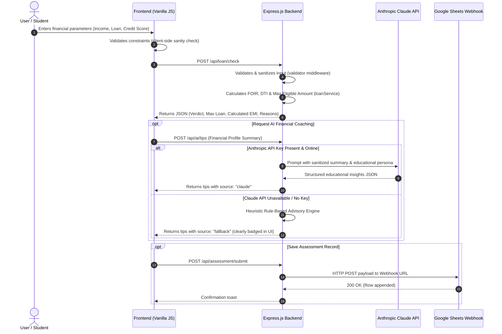

# AI Loan Eligibility Checker 🏦

[](https://nodejs.org/)
[](LICENSE)
[](https://www.anthropic.com/)
[](#educational-disclaimer)

A modern, responsive, full-stack educational financial evaluation platform. It demonstrates how fintech institutions assess retail loan eligibility using deterministic mathematical rules, analyzes credit score health across weighted industry factors, simulates Equated Monthly Installments (EMI) with full amortization schedules, generates AI financial coaching powered by the **Anthropic Claude API** (with a graceful, clearly labeled offline fallback), and logs assessment records to **Google Sheets**.

---

## ⚠️ Educational Disclaimer

> **IMPORTANT**: This application is an academic college project developed exclusively for educational and demonstration purposes. It uses heuristic financial formulas to simulate retail credit assessment. It **does not** constitute a real-world lending institution, does **not** provide actual bank loan approvals or credit decisions, and does **not** offer certified financial or legal counsel.

---

## ✨ Features & Modules

### 1. Deterministic Loan Eligibility Checker
- **Transparent Mathematical Decisioning**: Evaluates net income, existing liabilities, requested principal, tenure, and interest rate.
- **Fixed Obligation to Income Ratio (FOIR)**: Dynamic risk thresholds based on income brackets ($40\%$, $50\%$, and $60\%$).
- **Maximum Approved Capacity**: Computes the true maximum borrowing limit using present value annuity mathematics.
- **Explainable Results**: Generates clear, itemized diagnostic reasons explaining the approval verdict.

### 2. Credit Score Health Analyzer
- **Simulated 300–900 Credit Gauge**: Instant visual feedback with color-coded risk tiers (*Excellent*, *Good*, *Fair*, *Poor*, *Critical*).
- **5-Factor Weighted Model**: Simulates standard bureau weightings (Payment History 35%, Credit Utilization 30%, History Length 15%, Credit Mix 10%, Recent Inquiries 10%).
- **Targeted Improvement Roadmap**: Actionable steps to optimize credit health.

### 3. Interactive EMI & Amortization Calculator
- **Standard Reducing Balance Formula**: Exact mathematical calculation verified against commercial banking benchmarks.
- **Synchronized Sliders & Numeric Inputs**: Real-time recalculation of monthly EMI, total interest, and total payable.
- **Principal vs. Interest Ratio Bar**: Instant visual breakdown of payment composition.
- **Detailed Amortization Table**: Period-by-period opening balance, EMI, principal portion, interest portion, and closing balance.

### 4. AI Financial Coaching (Anthropic Claude API)
- **Constructive Guidance**: Generates personalized, non-jargon educational insights based on the applicant's calculated debt-to-income profile.
- **Strict Guardrails**: Claude strictly serves as an educational coach; core eligibility and scores are **never** calculated or altered by the AI.
- **Transparent Offline Fallback**: If an API key is unconfigured or Claude is offline, the backend seamlessly activates an offline rule-based advisory engine. Responses are **explicitly labeled** in the UI as *"Demo Rule-Based Guidance (Offline Fallback)"*.

### 5. Google Sheets Integration
- **Server-Side Webhook**: Uses a lightweight Google Apps Script Web App to log assessment records.
- **Privacy & Security**: Zero client-side exposure of webhook URLs; all transmission is mediated by the Node.js backend.

---

## 🛠️ Tech Stack

- **Frontend**: Pure HTML5, CSS3, Vanilla JavaScript (ES6+). Zero build step, lightweight, and fast.
- **Backend**: Node.js, Express.js.
- **AI Integration**: Anthropic Claude API via official `@anthropic-ai/sdk`.
- **Data Persistence**: Google Sheets via Google Apps Script Webhook.
- **Security & Reliability**: Helmet HTTP headers, configurable CORS, input sanitization, and Express rate limiting.
- **Testing**: Node.js native test runner (`node --test`).

---

## 🏛️ Architecture & Data Flow



---

## 📁 Folder Structure

```
AI Loan Eligibility checker/
├── public/                          # Frontend static assets (Pure HTML5/CSS3/Vanilla JS)
│   ├── css/
│   │   ├── variables.css            # Color tokens, spacing, typography
│   │   └── style.css                # Responsive grid, cards, gauges, charts, tables
│   ├── js/
│   │   ├── config.js                # Frontend API base URL configuration
│   │   ├── api.js                   # Client fetch client with timeout & error handling
│   │   ├── loanChecker.js           # Module 1: Loan Eligibility assessment UI
│   │   ├── creditAnalyzer.js        # Module 2: Credit score breakdown & visual gauge
│   │   ├── emiCalculator.js         # Module 3: Real-time sliders & amortization table
│   │   ├── aiTips.js                # Module 4: AI financial tips & fallback badge
│   │   ├── sheetsSubmission.js      # Module 5: Google Sheets submission & history log
│   │   └── app.js                   # Application shell coordinator, tabs & toasts
│   ├── index.html                   # Single-Page Application HTML
│   └── favicon.ico                  # Application icon
├── server/                          # Node.js + Express backend
│   ├── config/
│   │   └── constants.js             # Financial threshold constants (FOIR, DTI, credit tiers)
│   ├── controllers/                 # Express request handlers
│   │   ├── loanController.js        # Eligibility assessment handler
│   │   ├── creditController.js      # Credit factor analysis handler
│   │   ├── emiController.js         # EMI & amortization handler
│   │   ├── aiController.js          # Claude API & fallback handler
│   │   └── sheetsController.js      # Google Sheets webhook dispatcher
│   ├── services/                    # Core computational business logic
│   │   ├── loanService.js           # Deterministic eligibility calculation algorithm
│   │   ├── creditService.js         # 5-factor weighted credit scoring algorithm
│   │   ├── emiService.js            # Standard reducing balance EMI & schedule generator
│   │   ├── claudeService.js         # Anthropic Claude SDK client with strict guardrails
│   │   └── sheetsService.js         # Webhook payload transmitter
│   ├── middleware/
│   │   ├── validator.js             # Input validation and sanitization
│   │   └── errorHandler.js          # Centralized error masking
│   ├── routes/
│   │   └── apiRoutes.js             # API route registration
│   └── index.js                     # Express server entry point
├── tests/                           # Automated test suite
│   ├── sanity.test.js               # Baseline configuration and math checks
│   ├── loanService.test.js          # FOIR, DTI, and eligibility tests
│   ├── emiService.test.js           # EMI formula precision tests
│   ├── creditService.test.js        # Credit factor weighting tests
│   ├── validation.test.js           # Input validation and rejection tests
│   └── api.test.js                  # Integration tests
├── .env.example                     # Environment template with dummy variables
├── .gitignore                       # Ignored files (node_modules, .env, logs)
├── package.json                     # Project manifest and scripts
├── Procfile                         # Cloud deployment process file
└── README.md                        # Documentation and setup guide
```

---

## 🚀 Quickstart & How to Run Locally

### Prerequisites
- **Node.js**: v18.0.0 or higher ([Download Node.js](https://nodejs.org/))
- **npm**: v9.0.0 or higher (packaged with Node.js)

### 1. Clone or Open the Repository
```bash
git clone https://github.com/your-username/ai-loan-eligibility-checker.git
cd ai-loan-eligibility-checker
```

### 2. Install Dependencies
```bash
npm install
```

### 3. Configure Environment Variables
Copy `.env.example` to create your local `.env`:
```bash
cp .env.example .env
```
*(On Windows PowerShell: `Copy-Item .env.example .env`)*

Open `.env` and fill in optional keys (the app runs perfectly even with keys empty due to offline fallbacks):
```env
PORT=3000
NODE_ENV=development
ALLOWED_ORIGINS=http://localhost:3000
ANTHROPIC_API_KEY=your_anthropic_api_key_here
GOOGLE_SHEETS_WEBHOOK_URL=your_google_apps_script_url_here
```

### 4. Start the Application
```bash
npm start
```
Open your browser and navigate to:
```
http://localhost:3000
```

---

## 🔑 Anthropic Claude API Setup & Integration

The application integrates the Anthropic Claude API (`@anthropic-ai/sdk`) to deliver contextual, personalized financial literacy coaching.

### 1. Configuration & Obtaining an API Key
1. Create or log in to your account at the [Anthropic Console](https://console.anthropic.com/).
2. Navigate to **API Keys** and generate a new key (`sk-ant-...`).
3. Copy `.env.example` to `.env` if you haven't already:
   ```bash
   cp .env.example .env
   ```
4. Set the key in your `.env`:
   ```env
   ANTHROPIC_API_KEY=sk-ant-api03-...
   ```
5. Restart the application server (`npm start`).

### 2. Claude's Strictly Limited Role & System Guardrails
By strict design and prompt engineering, **Claude is an educational mentor only**:
- **NO Calculation of Financial Numbers**: Claude does **not** calculate loan eligibility, does **not** compute eligibility scores, does **not** calculate EMI, and does **not** determine FOIR or DTI.
- **NO Decision Authority**: Claude **cannot** approve or decline loans, alter credit scores, or override the deterministic financial calculation results.
- **Role Boundary**: All numerical metrics are computed 100% deterministically by the backend financial engines first. These results are then supplied to Claude purely as contextual facts so that Claude can generate qualitative educational coaching (strengths, vulnerabilities, and actionable improvement steps).

### 3. Automatic Deterministic Fallback Behavior
The application is built for maximum presentation resilience. If:
- `ANTHROPIC_API_KEY` is omitted or empty,
- Claude API servers are unreachable or network is offline,
- An API error (HTTP 4xx / 5xx) occurs,
- Anthropic rate limits are reached (HTTP 429), or
- The API call exceeds the 10-second timeout,

the backend **automatically and seamlessly switches to the built-in deterministic rule-based advisory engine**.
- The API response and UI clearly label the source:
  - **Claude Active**: `source: "claude"`, Badge: `"✨ Powered by Anthropic Claude (claude-3-5-sonnet)"`
  - **Fallback Active**: `source: "fallback"`, Badge: `"⚡ Demo Rule-Based Guidance (Offline Fallback)"`
- This ensures the college demo can be presented anytime without dependency on external network access or paid API credits.

### 4. Security & Secret Containment
- **Backend Only**: The Anthropic API key is loaded into Node.js via `dotenv` and is strictly never transmitted to the browser, frontend JavaScript, or HTML.
- **Redaction in Logs & Stack Traces**: The server's structured logger and centralized error handlers automatically scrub API keys matching `sk-ant-*` and replace them with `[REDACTED_API_KEY]`.
- **Git Protection**: `.env` is permanently listed in `.gitignore` to prevent accidental credential commits.

---

## 📊 Google Sheets Integration Setup (Google Apps Script Webhook)

The application integrates with Google Sheets via a secure, zero-dependency **Google Apps Script Webhook**. No GCP service account JSON key downloads or complex IAM configurations are required.

### 1. Create a Google Sheet
Create a new Google Sheet named **"AI Loan Assessments"** and paste this exact header into Row 1:
```
Timestamp | Applicant Name | Email | Monthly Income (₹) | Loan Requested (₹) | Tenure (Mos) | Interest Rate (%) | Credit Score | Calculated EMI (₹) | Max Approved (₹) | Status | Risk Tier | Eligibility Score (/100)
```

### 2. Open Apps Script Editor
In the top menu of your Google Sheet, click **Extensions** → **Apps Script**.

### 3. Paste the Webhook Handler Code
Replace all code in the editor (`Code.gs`) with this snippet:
```javascript
function doPost(e) {
  try {
    var sheet = SpreadsheetApp.getActiveSpreadsheet().getActiveSheet();
    var data = JSON.parse(e.postData.contents);
    
    sheet.appendRow([
      data.timestamp || new Date().toISOString(),
      data.applicantName || 'Anonymous Demo Applicant',
      data.applicantEmail || 'N/A',
      data.monthlyIncome || 0,
      data.requestedLoanAmount || 0,
      data.tenureMonths || 0,
      data.interestRate || 0,
      data.creditScore || 0,
      data.calculatedEmi || 0,
      data.maxEligibleAmount || 0,
      data.status || 'N/A',
      data.riskTier || 'N/A',
      data.eligibilityScore || 0
    ]);
    
    return ContentService.createTextOutput(JSON.stringify({ success: true, message: "Assessment record saved successfully" }))
      .setMimeType(ContentService.MimeType.JSON);
  } catch (err) {
    return ContentService.createTextOutput(JSON.stringify({ success: false, error: err.toString() }))
      .setMimeType(ContentService.MimeType.JSON);
  }
}
```

### 4. Deploy as a Web App
1. In the top right of the Apps Script editor, click **Deploy** → **New deployment**.
2. Click the gear icon next to "Select type" and select **Web app**.
3. Set **Description**: `Loan Assessment Logger`.
4. Set **Execute as**: `Me (your-email@gmail.com)`.
5. Set **Who has access**: `Anyone` *(crucial so the backend can POST records without OAuth tokens)*.
6. Click **Deploy**, authorize permissions if prompted, and copy the **Web app URL** (`https://script.google.com/macros/s/.../exec`).

### 5. Configure the Environment Variable
Paste your Web app URL into your backend `.env` file:
```env
GOOGLE_SHEETS_WEBHOOK_URL=https://script.google.com/macros/s/your_deployment_id/exec
```
Restart the server (`npm start`).

### 6. Offline / Unconfigured Handling & Security
- **Confidentiality**: The `GOOGLE_SHEETS_WEBHOOK_URL` is kept **strictly on the backend**. It is never sent to the browser or returned in API responses.
- **Graceful Offline Degradation**: If `GOOGLE_SHEETS_WEBHOOK_URL` is omitted, offline, or returns a network error, the backend catches the issue and records the submission in the local browser session without crashing.

---

## 🧪 Testing Instructions

Run the automated test suite using the Node.js native test runner:
```bash
npm test
```

The test matrix validates:
- Standard financial constants and boundaries.
- Input validation and XSS sanitization.
- Reducing balance EMI formula accuracy.
- Loan eligibility FOIR and DTI calculations.
- Credit score 5-factor weighted algorithms.
- Graceful handling of missing or offline services.

---

## ☁️ Deployment Instructions

### Option 1: Unified Full-Stack Deployment (Render / Railway)
The Node.js Express server automatically serves both the API and the static frontend from `public/`.
1. Push this repository to GitHub.
2. Link the repository to [Render](https://render.com) or [Railway](https://railway.app) as a **Web Service**.
3. Build Command: `npm install`
4. Start Command: `npm start`
5. Configure Environment Variables (`ANTHROPIC_API_KEY`, `GOOGLE_SHEETS_WEBHOOK_URL`, `NODE_ENV=production`).

### Option 2: Decoupled Deployment (Frontend on Vercel / Netlify, Backend on Render)
1. Deploy the backend to Render/Railway.
2. In `public/js/config.js`, set `API_BASE_URL` to your live backend domain:
   ```javascript
   API_BASE_URL: 'https://your-api-domain.onrender.com/api'
   ```
3. Deploy the `public/` directory to Netlify or Vercel.
4. Set `ALLOWED_ORIGINS` in your backend `.env` to your frontend domain to permit CORS.

---

## 📸 Screenshots & UI Showcase

*(Add project screenshots here after running locally)*
- **Dashboard & Eligibility Assessment**: Interactive sliders, real-time FOIR calculation, and status badges.
- **Credit Health Gauge**: Dynamic speedometer with 5-factor score breakdown.
- **Amortization Schedule**: Full reducing balance month-by-month table.
- **AI Financial Coach**: Contextual recommendations with transparent source badging.

---

## 🎓 Academic Attribution & Project Info

- **Project Title**: AI Loan Eligibility Checker
- **Academic Course**: College Capstone / Final Year Project
- **Developer**: Student Project Team
- **Supervisor / Project Guide**: Department Faculty Guide
- **License**: MIT License
